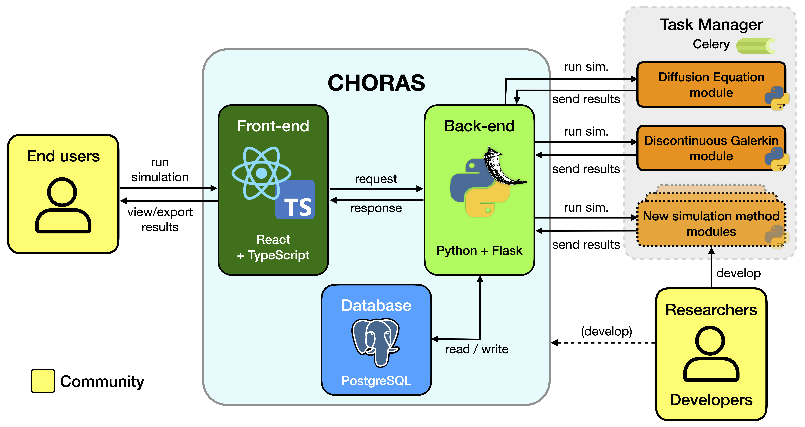

# Summary

Room acoustics simulation software is used for improving the acoustics in new or existing spaces, as well as for purposes in acoustics research. Various (open-source) room acoustics simulation methods exist, but many require technical know-how to be used. The Community Hub for Open-source Room Acoustics Software (CHORAS) is a web application that aims to bridge the gap between room acoustics simulation research software on the one hand, and the end-user on the other hand. Furthermore, CHORAS allows for easier comparison between the simulation methods as it uses the same pre- and postprocessing pipelines for all.

# Statement of need

The field of simulating room acoustics has a history of several decades, and over the years, many different software has been created around this topic. Room acoustics simulation software can be used by acoustic consultants, who use it to, for instance, predict important acoustic characteristics of spaces before they are built, or to make changes to existing spaces to improve their acoustics. Academic researchers use this type of software to investigate acoustics in a controlled environment and to avoid the need for real spaces. (<- \@Maarten/Marco you can probably write this much better)

Although in recent years, an increasing amount of effort has been put in making these software open source, many exist as code repositories and require technical know-how to be used [@Hornikx:2024]. This decreases the impact that these software (as well as the research behind them) have, in terms of how much they are used. Furthermore, as each software uses its own pre- and postprocessing pipelines, it is difficult to compare their results in, for instance, round-robin studies [@Dijkman:2025].

The Community Hub for Open-source Room Acoustics Software (CHORAS) is a web application that aims to resolve the aforementioned issues [@Willemsen:2025]. CHORAS allows other researchers, universities and/or institutions to add their own (open-source) room acoustics simulation methods. This way, software packages which would be hard to install and use for (non-technical) users can now be made available through a user friendly interface (see Figure \ref{fig:screenshot}). 

CHORAS is built with a modern web application stack (React.js frontend, Python backend) with cloud deployment in mind [@Teymoori:2024]. It can be found in an online repository [@CHORAS], and Figure \ref{fig:architecture} shows an illustration of the architecture. The authors intend to deploy CHORAS to the cloud; not only to bypass a potentially tedious installation procedure, but also such that heavy computations can be offloaded from the user's machine to cloud servers (potentially using GPUs).

Another software package that allows others to add their own simulation methods is i-Simpa [@Picaut:2012; @iSimpa]. However, this package relies on local installation and can not benefit from the scalability of cloud computing.

The goal of CHORAS is threefold:

1. to provide a platform for researchers to bring their room acoustics software closer to end users,
2. to provide (non-technical) end-users an easy way to use existing and new simulation methods, and
3. to allow various room acoustics simulation methods to be easily compared.

Altogether, CHORAS aims to bridge the gap between (new) research in the field of room acoustics simulation software and the end user, increasing the impact of the collective work of the room acoustics simulation research community and providing novel tools for the end user in a user friendly package.

## Open-Source Collaboration

CHORAS is a collaboration between various universities and institutes working on room acoustics simulation software, front-end developers, acoustic consultants (i.e., the end user).

Room acoustics simulation methods which are already coupled:

| Name                                  | Paper(s)                     | Repository |
|----------|:---------------:|:-----------------:|
| Acoustic diffusion equation (DE)      | @Fichera:2025, @Fichera:2024 | @Fichera_acousticDE_2025 |
| Discontinuous Galerkin (DG)           | @Wang_DG_RoomAcoustics_2024  | @wang2024open            |
| pyroomacoustics                       | @Scheibler:2018              | @pyroomacoustics         |
| DEISM                                 | @Xu:2024                     | @DEISM                   |
| SPPS                                  | @Picaut:2012                 | @iSimpa                  |
| DeepONet                              | @borrel-jensen2023sound      | @deeponet:2025           |
| ParallelFDTD                          | @Saarelma:2014               | @parallelFDTD            |

_more here? maybe something about each simulation method having its own set of parameters, but that we aim for most parameters to be the same for all methods.._

# Acknowledgements

The authors would like to thank Sil de Graaf for the graphic design of the CHORAS. Finally, the authors appreciate the help of John Bons for his guidance on cloud deployment.

# References