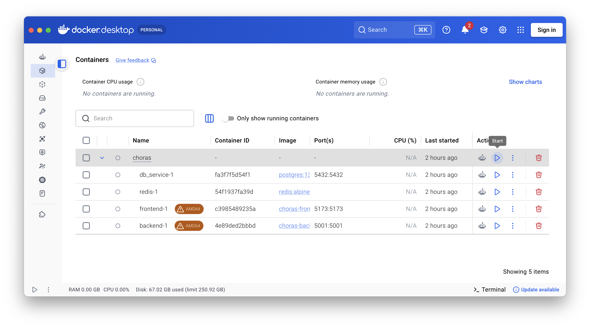

.. _starting-choras:

Starting CHORAS
===============

Once CHORAS has been built, the build script (see the :ref:`building-choras` section)  can be used to start CHORAS again in the future.
Note that this may result in a longer startup time on slower machines.
Alternatively, you CHORAS can be started with the following command:

.. code-block:: bash

   docker compose up

You can terminate CHORAS either by pressing ``Ctrl + C`` in the terminal.
This will stop the containers but keep them available for the next startup.

Docker GUI
----------

If you prefer using a graphical user interface to start and stop the CHORAS Docker container.
In the Docker Desktop application, you can find the CHORAS container under the **Containers** section.
From there, you can start, stop, and manage the container as needed using the buttons in the **Actions** column, see image below.

Web Interface
-------------

Once CHORAS is running, you can access the web interface by opening your browser and navigating to `http://localhost:5173/ <http://localhost:5173/>`_.
This will bring up the CHORAS user interface where you can start using the software.

.. image:: choras_gui.png
   :alt: CHORAS web interface showing the geometry view of an example project.
