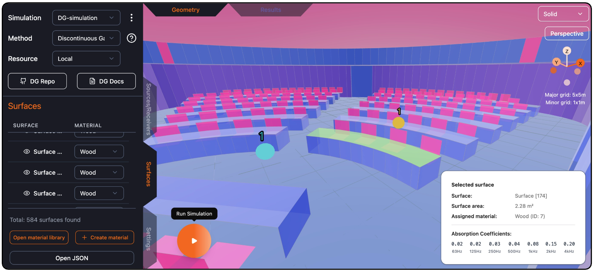

CHORAS
======

This is the documentation for CHORAS, the Community Hub for Open Source Room Acoustics Software.

Below you can find instruction on how to set up CHORAS for users and developers, as well as contibution guidelines for developers and contributors of simulation methods.

.. toctree::
   :maxdepth: 1
   :caption: Installing CHORAS

   includes/setup.rst

.. toctree::
   :maxdepth: 1
   :caption: User Guide

   includes/user_guide.rst

.. toctree::
   :maxdepth: 1
   :caption: Contribution Guidelines

   includes/contributing.rst
