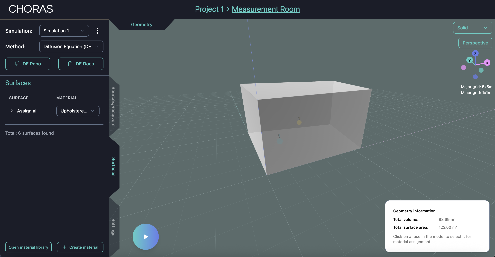

# Summary

# Statement of need

The field of simulating room acoustics has a history of several decades and over these years, much software has been created around this topic. Room acoustics simulation software is used by acoustic consultants, who use it to, for instance, predict important acoustic characteristics of spaces before they are built, or to make changes to existing spaces to improve their acoustics. Academic researchers use the software to investigate acoustics in a controlled environment and to avoid the need for real spaces. (<- @Maarten you can probably write this much better)

Although in recent years, an increasing amount of effort has been put in making these software open source, many exist as code repositories and require technical know-how to be used [@Hornikx:2024]. Furthermore, each software uses its own pre- and postprocessing pipelines and can therefore not easily be compared.

The Community Hub for Open-source Room Acoustics Software (CHORAS) is a 

aims to [@Willemsen:2025]

[@CHORAS]

![The CHORAS architecture (taken from [@Willemsen:2025]).\label{fig:example}](JOSS_paper_figures/CHORAS-functionality.pdf)
CHORAS-functionality
The goal of CHORAS is threefold:

1. to provide a platform for researchers to bring their room acoustics software closer to end users,
2. to allow (non-technical) end-users an easy way to use existing and new simulation methods, and
3. to create an easy way for various room acoustics simulation methods to be compared.

Altogether, CHORAS intends bridge the gap between (new) research in the field of room acoustics and the end user, increasing the impact of the collecive work if the room acoustics simulation research community and providing novel tools for the end user in a user friendly package.

As each simulation method has its own set of parameters

### Input
- Geometry (.obj)
- 

### Output

CHORAS is a collaboration between various universities and institutes working on room acoustics simulation software, front-end developers, acoustic consultants (i.e., the end user).

Room acoustics simuation methods which are already coupled:

| Name | Paper(s)         | Repository |
|----------|:---------------:|:-----------------:|
| Acoustic diffusion equation (DE)      | @Fichera:2025, @Fichera:2024 | @Fichera_acousticDE_2025 |
| Discontinuous Galerkin (DG)           | @Wang_DG_RoomAcoustics_2024  | @wang2024open            |
| Pyroomacoustics                       | @Scheibler:2018              | @pyroomacoustics         |
| DEISM                                 | @Xu:2024                     | @DEISM                   |
| SPPS                                  | @Picaut:2012                 | @iSimpa                  |
| DeepONet                              | @borrel-jensen2023sound      | @deeponet:2025           |
| ParallelFDTD                          | @Saarelma:2014               | @parallelFDTD            |

# Citations

Citations to entries in paper.bib should be in
[rMarkdown](http://rmarkdown.rstudio.com/authoring_bibliographies_and_citations.html)
format.

If you want to cite a software repository URL (e.g. something on GitHub without a preferred
citation) then you can do it with the example BibTeX entry below for @fidgit.

For a quick reference, the following citation commands can be used:
- `@author:2001`  ->  "Author et al. (2001)"
- `[@author:2001]` -> "(Author et al., 2001)"
- `[@author1:2001; @author2:2001]` -> "(Author1 et al., 2001; Author2 et al., 2002)"

# Figures

Figures can be included like this:

and referenced from text using \autoref{fig:example}.

Figure sizes can be customized by adding an optional second parameter:
{ width=20% }

# Acknowledgements

John Bons?

Sil de Graaf for design

# References